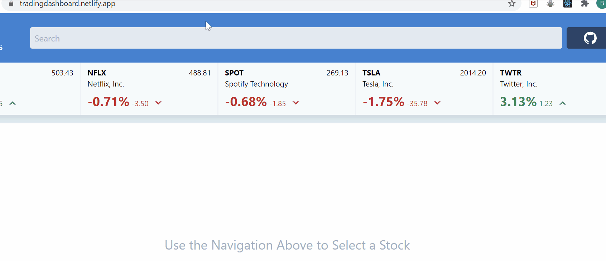

A debouncer is a method used to delay a function invocation until a defined period has elapsed. If the function is called before the period elapses, then the function will not invoke. Instead, the time-out period resets, and--depending on the implementation of the debouncer--a further delay will occur before invocation.


<figcaption style="font-size: 14px; opacity: 0.8; text-align: center;">Debouncer visualized. Colored tiles are function invocation.</figcaption>
<br>
This method is useful in applications where some operations are potentially expensive. For example, querying a search result on every key press, requesting data over a network, or executing computationally intensive operations can benefit from delaying or rejecting the execution of some requests.



<figcaption style="font-size: 14px; opacity: 0.8; text-align: center;">Debouncing a search query on each key press.</figcaption>
<br>
Below I implement a way to use a debouncer in a JavaScript file that takes advantage of these features, utilizing Test Driven Development (TDD).

# Test-Driven Development

For the debouncer I'm going to build, when called, the function should execute immediately. This is an example of a leading debouncer (although many debouncer functions, such as [Lodash's](https://lodash.com/docs/4.17.15#debounce), use a trailing debouncer by default).

```javascript
//debouncer.test.js
describe("debouncer test suite", () => {
  it("should invoke immediately the first time it is invoked.", () => {
    let mutable;
    debounce = debouncer(function(update) {
      mutable = update;
    }, 300);
    debounce("Hello, World");
    expect(mutable).toBe("Hello, World");
  }
});
```

To make this test pass, we want to define a debouncer function which will accept two parameters: the function we need to debounce, and the timeout period.

```javascript
//debouncer.js
function debouncer(fn, timeout) {
  return function (...args) {
    fn.call(this, ...args)
  }
}
```

The provided function executes every time we invoke the debouncer. Let's write a second test that catches only the first invocation, but not the subsequent one.

```javascript
//debouncer.test.js
...
it("should not be executed twice if the timeout period has not elapsed", () => {
  let count = 0;
  debounce = debouncer(function(increment) {
    count = count + increment;
  }, 300);
  debounce(2);
  debounce(4);
  expect(count).toBe(2);
});
```

Initially the test will fail. We need a way to know if the function has already been invoked.

```javascript
//debouncer.js
function debouncer(fn, timeout) {
  this.invoke = true

  return function (...args) {
    if (this.invoke) {
      this.invoke = false
      fn.call(this, ...args)
    }
  }
}
```

This will pass the second test. However, this will still not be production-ready as this method will call a function once and only once. We need to update our `invoke` variable once the timeout period has elapsed. So far, all the tests passed without the function's second parameter because we did not need it. Let's find a way to use it now:

```javascript
//debouncer.test.js
it("should execute again after the timeout period is complete", done => {
  let count = 0
  debounce = debouncer(function (increment) {
    count = count + increment
  }, 300)
  debounce(2)
  debounce(4)
  setTimeout(function () {
    debounce(1)
    expect(count).toBe(3)
    done()
  }, 400)
})
```

To pass this test, I created a method to reset the timer every time we call the debouncer. Additionally, I have a timeout handler that will set and clear timeouts. Only when the timeout has elapsed will the provided function be able to execute.

```javascript
//debouncer.js
function debouncer(fn, timeout) {
  this.invoke = true;
  this.timeoutHandler = undefined;

  function _resetTimer() {
    if (this.timeoutHandler) {
      clearTimeout(this.timeoutHandler);
    }

    //Set a timeout to update the invocation state with that timer.
    this.timeoutHandler = setTimeout(function () {
      this.invoke = true;
    }, timeout);
    }
  }

  function debouncedFunction(...args) {
    if (this.invoke) {
      this.invoke = false;
      fn.call(this, ...args);
    }
    _resetTimer();
  }

  return debouncedFunction;
}
```

Here would be a good point to refactor the test suite and functions as needed.
<br>

# Conclusion

By using TDD, we are building both the function and the test suite for it. This allows for robust code, where we can add any incremental features with the safety of ensuring all previous tests passing as well. Some additional features and tests could include input validations, a configuration option (perhaps it would be useful to give the user options to indicate if they want a leading or trailing debouncer), or anything else needed for whatever project you're building.

I've created a similar debounce method as an NPM package with a little bit more robust test suite, which can be found [here](https://www.npmjs.com/package/@somethingscripted/debouncer).

Thanks for reading.

_Ben_
