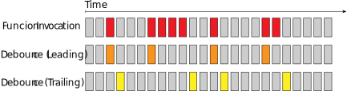

A debouncer is a method used to delay a function invocation until a certain time period has elapsed. If the function is called before the time period has elapsed, then the function will not be invoked and the delay will reset.


<figcaption style="font-size: 12px; opacity: 0.8; text-align: center;">Example of a debouncer. Colored Tiles are function invocation.</figcaption>

This method is useful in applications where certain operations may be expensive. For example, querying a search result on every keypress, requesting data across a network, or executing computationally intensive functions.

Below I implement a leading debounce function that takes advantage of these features, utilizing TDD.

# Test-Driven Development

For a leading debouncer, the function should execute immediately the first time it is called.

```javascript
//debouncer.test.js
describe("debouncer test suite", () => {
  it("should invoke immediately the first time it is invoked.", () => {
    let mutable;
    debounce = debouncer(function(update) {
      mutable = update;
    }, 300);
    debounce("Hello, World");
    expect(mutable).toBe("Hello, World");
  }
});
```

To make this test pass, we first need to define the debouncer function to take in the callback parameter and the timeout period.

```javascript
//debouncer.js
function debouncer(fn, timeout) {
  return function (...args) {
    fn.call(this, ...args)
  }
}
```

Here, the debouncer is simply executing the function everytime it is invoked. The timeout was not used because that was not needed to pass this test. Let's find a way to use it now:

```javascript
//debouncer.test.js
...
it("should not be executed twice if the timeout period has not elapsed", () => {
  let count = 0;
  debounce = debouncer(function(increment) {
    count = count + increment;
  }, 300);
  debounce(2);
  debounce(4);
  expect(count).toBe(2);
});
```

Initially the test will fail. We need a way to know if the function has already been invoked. Here's one way of doing just that:

```javascript
//debouncer.js
function debouncer(fn, timeout) {
  this.invoke = true

  return function (...args) {
    if (this.invoke) {
      this.invoke = false
      fn.call(this, ...args)
    }
  }
}
```

This will pass the second test. However, this will still not be production-ready as this method will call a function once and _only_ once. What needs to be implemented is a way to know if we are in a timeout period, and not invoke the function if we are.

```javascript
//debouncer.test.js
it("should not be executed twice if the timeout period has not elapsed", done => {
  let count = 0
  debounce = debouncer(function (increment) {
    count = count + increment
  }, 300)
  debounce(2)
  debounce(4)
  setTimeout(function () {
    debounce(1)
    expect(count).toBe(3)
    done()
  }, 400)
})
```

To pass this test, I created a method to reset the timer everytime the debouncer is called and a timeout handler to set and clear timeouts. Only when the timeout has elapsed will the provided function be able to invoke.

```javascript
//debouncer.js
function debouncer(fn, timeout) {
  this.invoke = true;
  this.timeoutHandler = undefined;

  function _resetTimer() {
    if (this.timeoutHandler) {
      clearTimeout(this.timeoutHandler);
    }

    //Set a timeout to update the invocation state with that timer.
    this.timeoutHandler = setTimeout(function () {
      this.invoke = true;
    }, timeout);
    }
  }

  function debouncedFunction(...args) {
    if (this.invoke) {
      this.invoke = false;
      fn.call(this, ...args);
    }
    _resetTimer();
  }

  return debouncedFunction;
}
```

Here would be a good point to refactor the test suite and functions as needed, In my case I've broken up some of the logics in it's own function within my debouncer.
<br>

# Conclusion

By using TDD, both the function and the test suite are being built together. This allows for robust code, where any incremental features can be added with the safety of all previous tests passing as well. Some additional features could include input validations, a configuration option (perhaps it would be useful to give the user options to indicate if they want a leading or trailing debouncer), or anything else needed for whatever project you're building.

I've created a similar debounce method as an NPM package with a little bit more robust test suite, which can be found [Here](https://www.npmjs.com/package/@somethingscripted/debouncer).

_Thanks for reading._
